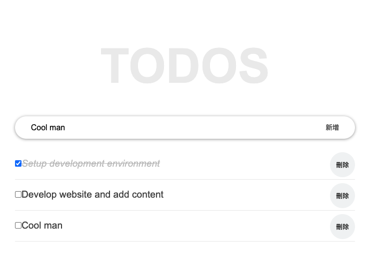

# Todo React

This is a proejct to practice React.js

## How to start
```
yarn install & yarn start
```

## Reference
- [React Tutorial for Beginners](https://ibaslogic.com/how-to-edit-todos-items-in-react/)